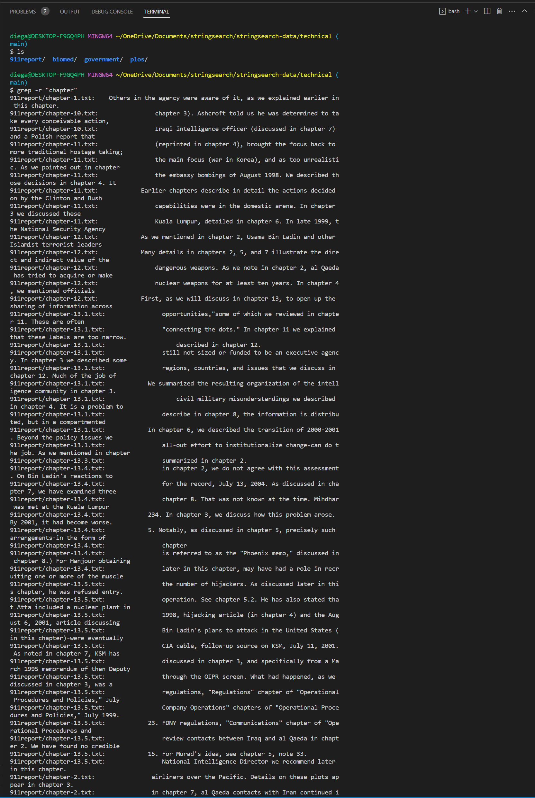
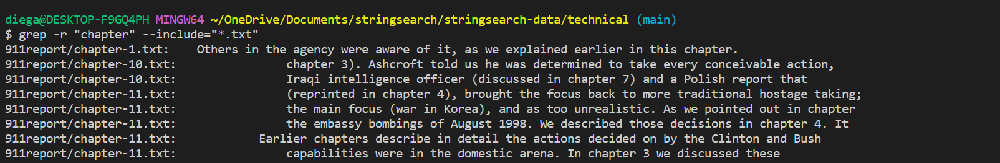
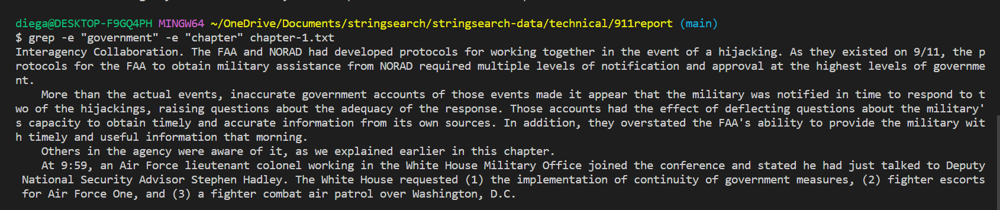
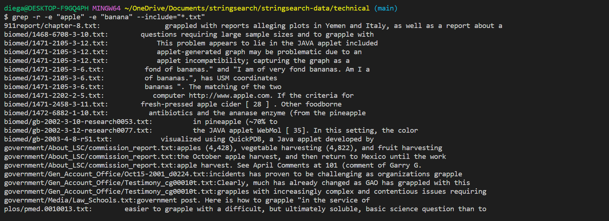
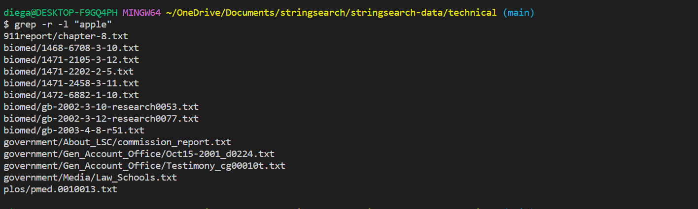
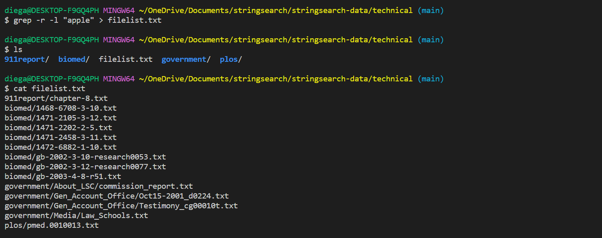
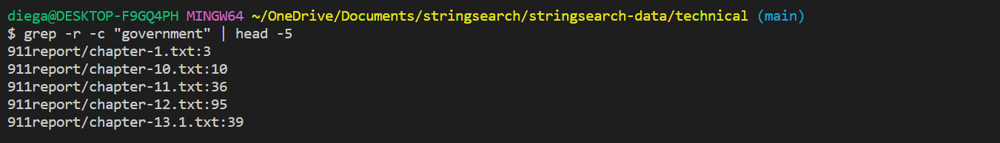

Lab Report 3
============

## The `grep` Command

### Recursive Searches

The grep command can look through directories recursively using the `-r` command option after grep! An sample use of the command is as follows:

In this example, the current working directory is /technical, in which there are 4 subdirectories and one of them containing further subdirectories. The `r` here is being used to search for the word "chapter" recursively through the subdirectories; however, you can also specify another word to include an extension like in this next example!

Using `--include=` allows us to enter the file extension we are looking for, in this case being ".txt" files. 

### Pattern Matching

The grep command line option `-e` can be used to specify patterns to search for within files and multiple patterns may also be specified! An example of using the `-e` command line option and specifying two patterns "government" and "chapter" is as follows:

The patterns "government and "chapter" are being looked for in the chapter-1.txt file and the lines that contain such pattern is then printed. You can also use `-e` to search for files in a directory that contain a pattern by using it in conjuction with the `-r` command line option. 

`-r` searches recursively through the subdirectories and `-e` matches the patterns "apple" and "banana" within those files that are being looked through!

### Pattern Matching v2

The grep command line option `-l` can be used to specify patterns similar to `-e`; however, the command will search through the files that contain the pattern and print the name of the file, rather than printing the lines within the file itself!

The `-l` command line option can be useful for finding files that have the specified pattern, rather than printing the lines themselves like with `-e` 

`-l` can be quite useful when trying to find the files with the specified patterns. We can redirect the output of the `-l` command to a new text file that we can use to modify or delete files with a specified pattern!

### Limiting Output/Pattern Matching Inverse

The `-c`command line option counts the number of times a pattern is present in a file, we can limit this to look in the first five files:    

This command will search for the pattern "government" recursively in the subdirectories of the technical directory, count the number of matches in each of the files, and output the first 5 files with matches. 

Similarly, we can use the `-c` command line option with grep to find patterns within the text files themselves, redirect the output to `wc` and display it. Here's an example of doing such while looking for the pattern "Session" within the technical/ directory.

The `wc -l` command is used to count the number of lines in the output of grep.

## Citations

All of the information about the different command line options were found using the manual and ChatGPT from OpenAI. 

Input and Output from ChatGPT:

